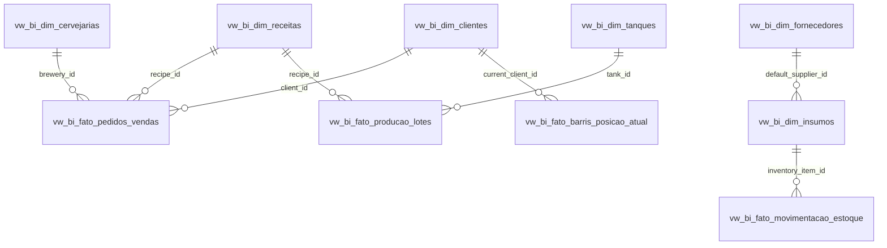

# 📊 Manual de Integração PintTech ➔ Microsoft Power BI

Bem-vindo ao guia de integração analítica do **PintTech** com o **Microsoft Power BI**. Com esta integração, 100% dos dados operacionais da cervejaria (Vendas, Lotes de Produção, Giro de Barris, Estoque e Financeiro) ficam acessíveis em tempo real para tomada de decisão executiva.

---

## 🏗️ 1. Arquitetura e Modelagem Dimensional (Star Schema)

Todas as views analíticas foram criadas no formato **Esquema Estrela (Star Schema)**, garantindo cálculos instantâneos no motor VertiPaq do Power BI:

---

## 🚀 2. Opções de Conexão

### Opção A: Web API / Feed REST (Recomendado para Nuvem)
* **Vantagem**: Não necessita de On-Premises Data Gateway; atualiza automaticamente nos servidores da Microsoft (PowerBI.com).
* **Segurança**: Isolamento multi-tenant garantido pelo seu Token de Acesso BI individual.
* **Como conectar**:
  1. No sistema PintTech, acesse o menu **Relatórios > Power BI**.
  2. Copie o seu **Token Analítico** e a **URL do Dataset** desejado (ou use os scripts prontos em `powerbi/PintTech_PowerQuery_M.txt`).
  3. No Power BI Desktop, clique em **Obter Dados > Web**, cole a URL e confirme.

---

### Opção B: Conexão Direta ao PostgreSQL
* **Vantagem**: Acesso nativo de alta velocidade a todas as 13 views analíticas SQL (`vw_bi_*`).
* **Como conectar**:
  1. No Power BI Desktop, clique em **Obter Dados > Mais... > Banco de Dados > Banco de Dados PostgreSQL**.
  2. Preencha os dados:
     - **Servidor**: `ep-proud-silence-axkarls5.us-east-2.aws.neon.tech` (ou host do seu .env)
     - **Banco de Dados**: `neondb`
     - **Modo**: *Importar* (ou *DirectQuery*)
  3. Insira o usuário e senha do Neon PostgreSQL.
  4. No navegador de tabelas, selecione o schema `public` e marque as views iniciadas por `vw_bi_`.

---

## 📋 3. Catálogo das Views Analíticas Prontas

| Nome da View SQL | Tipo | Descrição dos Dados |
| :--- | :---: | :--- |
| `vw_bi_fato_pedidos_vendas` | **Fato** | Itens faturados, clientes, receitas, preços, fretes, margens e status. |
| `vw_bi_fato_producao_lotes` | **Fato** | Lotes de produção, rendimentos, parâmetros físico-químicos (OG, FG, ABV, pH) e custos. |
| `vw_bi_fato_barris_posicao_atual` | **Fato** | Status em tempo real de cada barril, tempo de permanência no cliente e volume. |
| `vw_bi_fato_barris_movimentacoes` | **Fato** | Histórico cronológico de leituras de QR Code, expedição, devolução e higienização. |
| `vw_bi_fato_financeiro` | **Fato** | Fluxo de caixa de receitas e despesas, vencimentos, liquidações e dias de atraso. |
| `vw_bi_fato_movimentacao_estoque` | **Fato** | Entradas de compras, saídas por brassagem e ajustes de perdas de matéria-prima. |
| `vw_bi_dim_clientes` | **Dimensão** | Cadastro completo de clientes, cidades, limites de crédito e barris retidos. |
| `vw_bi_dim_receitas` | **Dimensão** | Ficha técnica de receitas, estilos BJCP, custos teóricos e preços de venda. |
| `vw_bi_dim_insumos` | **Dimensão** | Catálogo de insumos (malte, lúpulo, leveduras) com saldo e custo unitário. |
| `vw_bi_dim_tanques` | **Dimensão** | Fermentadores e maturadores com capacidades e status de ocupação. |
| `vw_bi_dim_equipamentos` | **Dimensão** | Chopeiras elétricas, cilindros de gás e extratoras em campo ou na fábrica. |
| `vw_bi_dim_fornecedores` | **Dimensão** | Fornecedores de malte, lúpulo, químicos e gases. |
| `vw_bi_dim_cervejarias` | **Dimensão** | Dados da organização e plano contratado (visão multi-tenant). |

---

## 📈 4. Medidas DAX Prontas
Para adicionar indicadores calculados ao seu dashboard, abra o arquivo `powerbi/PintTech_DAX_Measures.md` e copie as fórmulas para:
- Faturamento Total & Ticket Médio
- Preço e Custo Médio por Litro de Chopp
- Giro Médio de Barris (Dias no Cliente)
- Barris Parados > 30 Dias (Alerta de Inadimplência de Vasilhame)
- DRE e Fluxo de Caixa Realizado vs Previsto
